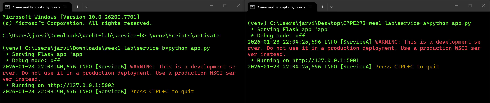
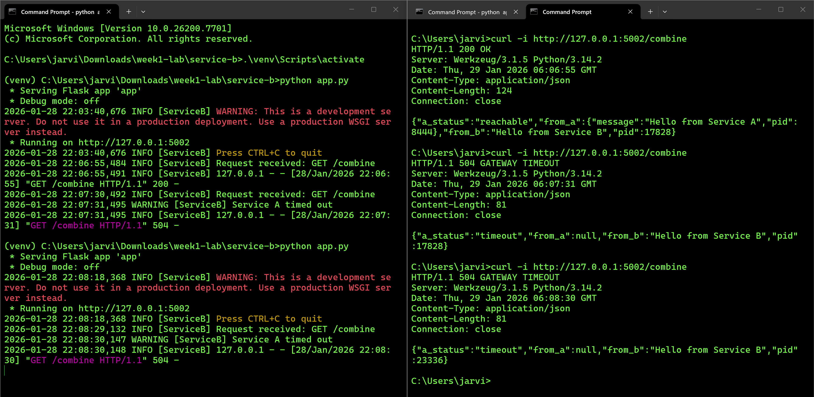
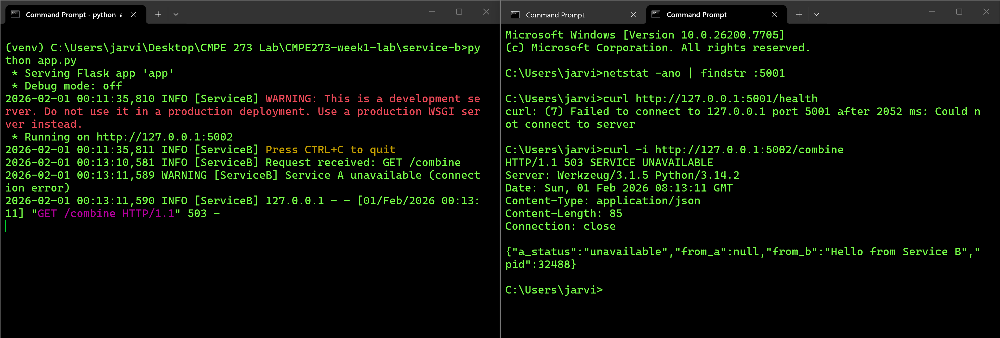

# CMPE 273 Week 1 Lab
## Author of this project: Hei Lam (SJSU SID: 014751503)

## Objective
The goal of this lab is to experience the core characteristics of a distributed system by building a small but real system locally.

This lab demonstrates:

- Independent services running as separate processes
- Communication over a network
- Failure propagation across service boundaries
- Basic logging and graceful error handling

Although both services run on the same machine, they behave as independent distributed components.


## System Overview

This system consists of two services:

### Service A (Provider)
- Runs independently on its own port
- Exposes a simple HTTP API
- Responds to requests from other services
- Logs incoming requests

### Service B (Consumer)
- Runs independently on its own port
- Exposes its own HTTP API
- Calls Service A over the network
- Handles failures gracefully when Service A is unavailable or slow

### Each Service:
- Runs as a separate process
- Listens on a different port
- Communicates via HTTP network calls


## How to run the Lab
### Step 1: Start Service A (Provider)

Open **Terminal 1**:
```bash
cd week1-lab/service-a
Python -m venv venv
source venv/bin/activate (macOS)
.\venv\Scripts\activate (Windows)
pip install flask requests
python app.py
```
Service A run on: http://127.0.0.1:5001 (The 8080 port is being used on my computer, so 5001 is used for this Lab.)

Test Service A: curl http://127.0.0.1:5001/data

### Step 2: Start Service B (Consumer)
Open **Terminal 2 (must be separate from Service A)**
```bash
cd week1-lab/service-b
python -m venv venv
source venv/bin/activate (macOS)
.\venv\Scripts\activate (Windows)
pip install flask requests
python app.py
```

Service B runs on: http://127.0.0.1:5002 (The 8081 port is being used on my computer, so 5002 is used for this Lab.)

Test Service B: curl http://127.0.0.1:5002/combine

## Demonstrating Distributed System Behavior
### Case 1: Normal Operation
with both services running:
```bash
curl - i http://127.0.0.1:5002/combine
```

Expected behavior:
- Service B successfully calls Service A
- Response includes data from both services
- Logs appear in both terminal windows

### Case 2: Service A Failure
Stop Service A using Ctrl + C.
Call Service B again:

```bash
curl -i http://127.0.0.1:5002/combine
```
Expected behavior:
- Service B returns HTTP 503
- Response indicates Service A is unavailable
- Service B continues running normally
- Failure is isolated and handled gracefully

### Case 3: Timeout / Slow Dependency
Restart Service A.
Modify the line of r = requests.get(f"{SERVICE_A_URL}/data", timeout=1.0) Service B to the following line to call the slow endpoint:
```bash
requests.get("http://127.0.0.1:5001/slow", timeout=1.0)
```

Call Service B again:
```bash
curl -i http://127.0.0.1:5002/combine

```
Expected behavior:
- Service B returns HTTP 504
- A timeout error is logged
- Service B remains responsive

### Case 4: Connection is Refused
Stop Service A completely by pressing Crtl + C

Verify that nothing is listening on port 5001
```bash
netstat -ano | findstr :5001
```
Correct (connection refused state): It should show no output on the terminal.

Prove Connection is Refused directly
```bash
curl http://127.0.0.1:5001/health
```

Call the Service B
```bash
curl -i http://127.0.0.1:5002/combine
```
Expected behavior:
- Service B returns HTTP 503
- Response indicates Service A is unavailable
- Service B continues running normally
- Failure is isolated and handled gracefully

## Screenshots of the Lab Results
### Case 1 Normal Operation
### Both Service A and Service B are on



### Case 2 Service A Failure
### (Only Service A off)


### Case 3 Timeout/Slow Dependency
### (Both Service A on again)


### Case 4: Connection is Refused
### (Service A is off)


## What makes this distributed?
This system is distributed because it consists of two independent services (Service A and Service B) running as separate processes that communicate over the network using HTTP rather than direct function calls. Each service has its own port, runtime, and failure behavior, meaning they can start, stop, or fail independently. Service B depends on Service A through network requests and must handle timeouts or connection failures gracefully, demonstrating real-world distributed system characteristics such as network communication, partial failures, and service isolation.

## What happens on timeout?
If Service A is reachable but responds too slowly (e.g., calling /slow with timeout=1.0), Service B waits until the timeout expires, catches requests.exceptions.Timeout, logs a warning like “Service A timed out”, and returns HTTP 504 (Gateway Timeout) with a JSON body indicating a_status: "timeout".

## What happens if Service A is down?
If Service A is stopped (or nothing is listening on its port), Service B’s request fails immediately with requests.exceptions.ConnectionError (often “connection refused”). Service B logs “Service A unavailable (connection error)” and returns HTTP 503 (Service Unavailable) with a_status: "unavailable". Service B keeps running—only the dependency fails.

## What do your logs show, and how would you debug?
The logs show request flow (e.g., Request received: GET /combine) and the failure classification (timeout vs unavailable) along with the HTTP status returned (504 or 503). To debug: (1) confirm which endpoint B is calling (/data vs /slow), (2) check Service A’s terminal logs to see whether it received the request, (3) verify connectivity to A with curl http://127.0.0.1:<A-port>/health, and on Windows (4) confirm the port is actually listening or closed using netstat -ano | findstr :<A-port> and kill any leftover PID with taskkill /PID <PID> /F.

## Failure Scenario Explanation
This lab demonstrates how failure propagates across service boundaries in a distributed system using two independently running services.

### Normal Operation
When both Service A and Service B are running, Service B successfully sends an HTTP request to Service A's /data endpoint. Service A responds normally, and Service B returns a combined response with HTTP 200. The logs in both services show successful request handling.

### Failure Scenario 1: Service A Timeout (HTTP 504)
In this scenario, Service A is running but responds slowly (for example, via the /slow endpoint).
Service B sends a request to Service A with a configured timeout. When Service A does not respond within the timeout window, Service B detects a timeout exception and returns HTTP 504 (Gateway Timeout).

This demonstrates:
- Service A is reachable but slow
- Service B remains operational
- Time-based failures propagate as timeouts rather than crashes

### Failure Scenario 2: Service A Unavailable (HTTP 503)
In this scenario, Service A is completely stopped and no process is listening on its port. When Service B attempts to call Service A, the network connection fails immediately. Service B catches the connection error and returns HTTP 503 (Service Unavailable).

This demonstrates:
- Independent failure of Service A
- Service B does not terminate or crash
- Service B degrades gracefully and reports downstream unavailability

### Failure Scenario 3: Connection Refused (HTTP 503)
In this scenario, Service A is not running and no process is listening on its assigned port. When Service B attempts to establish a network connection to Service A, the operating system immediately refuses the connection. Service B catches the connection refusal error and returns HTTP 503 (Service Unavailable).

This demonstrates:
- Service A is unreachable at the network level
- The connection is refused immediately rather than timing out
- Service B continues running without crashing
- Network-level failures are handled gracefully and isolated from the consumer service
- Network-level failures are handled gracefully and isolated from the consumer service
